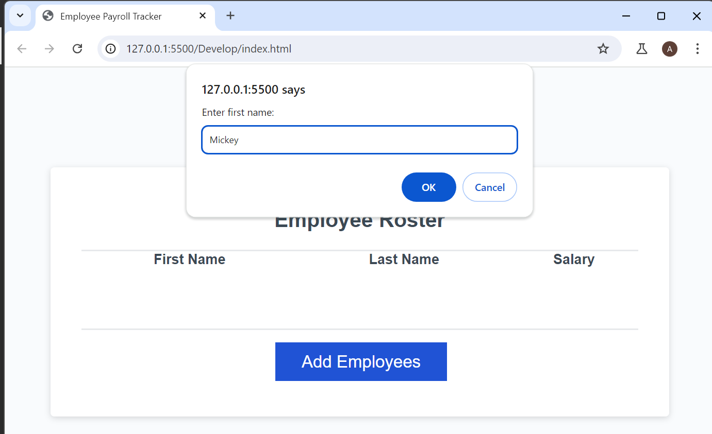
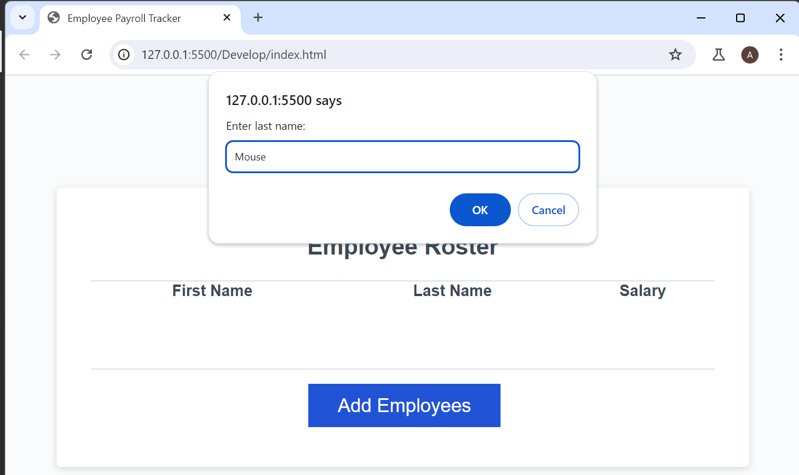
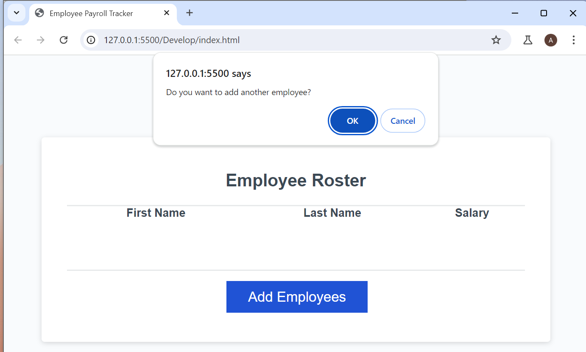
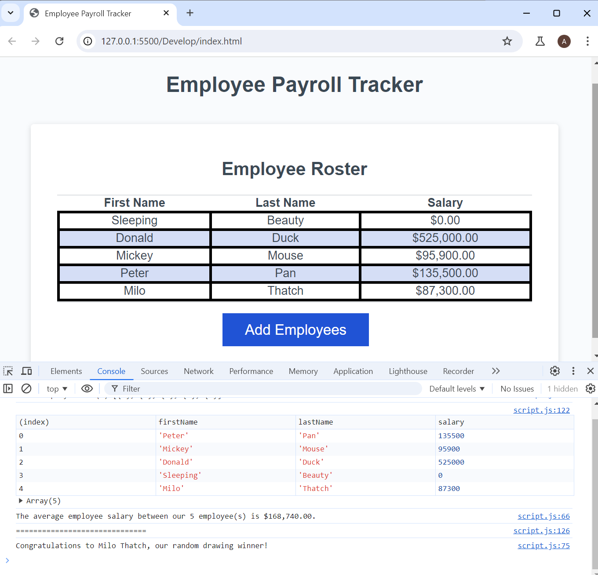

# Employee Payroll Tracker Starter Code

## Task

In this Challenge I modified starter code to create an application that enables a payroll manager to view and manage employee payroll data.
I filled out the following functions:

### collectEmployees: 
This function allows a user to add multiple employees to display on the page. 
- The prompt() method was used to add the first name, last name, and salary of each employee, confirm() method - to choose to continue or stop, and do-while loop - to keep adding employees until user chooses to stop.
- The salary input was validated if of type Number by using isNaN() method, and defaulted to $0 if its input was not a number.
- This function returned added employees as an array objects. 

### displayAverageSalary: 
This function takes in the generated array of employees and log the average salary and and uses a template literal to log number of employees to the console.
- The built-in Math.trunc() method was used to remove fractional digits for a calucalted average salary and toLocaleStringto() to format the salary as US currency.

### getRandomEmployee: 
This function takes in the generated array of employees, randomly selects one employee, and uses a template literal to log employee full name to the console. 
- The built-in Match.random() was used to select a random employee and Math.floor() to round down to its nearest integer.

## Screenshots

## Review

The URL of the deployed application: [Professional Portfolio (akravt1274.github.io)Links to an external site.](https://akravt1274.github.io/Challenge-Professional-Portfolio/)
